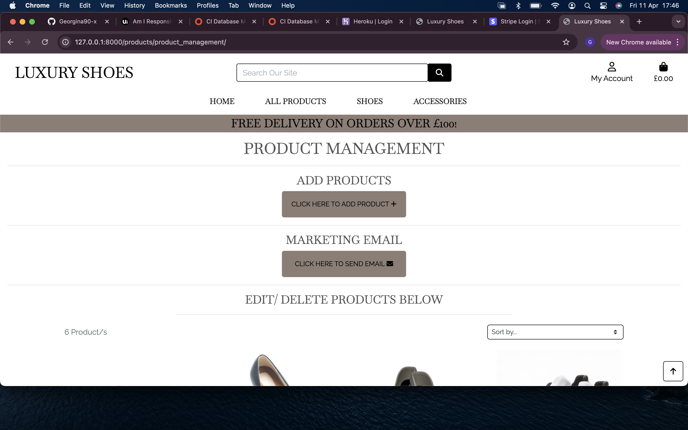

# [Luxury Shoes](https://luxury-shoes-00974b0f1528.herokuapp.com/ "Click to view the deployed site")

- Luxury Shoes is an ecommerce website designed to sell womens shoes and accessories.
- Luxury Shoes is an ecommerce website designed to be easily navigated using standard ecommerce conventions.
- Luxury Shoes is an ecommerce website that allows users to browse products through categories, ratings, price and via a search bar using key words.
- Luxury Shoes has a crisp and clear aesthetic that makes it easy for the user to see the products and their details.
- Luxury Shoes allows users to add products to a shopping basket and purchase them, creating an order.
- In order to make a test purchase on Luxury Shoes please use the following details:
Card Number: 4242 4242 4242 4242 Exp: 02/26 Zip Code: 24242

## Table of Contents

<details>
<summary>Click here for Table of Contents</summary>

[Mockup Screenshots](#mockup-screenshots)

[UX](#ux)

- [Colour Scheme](#colour-scheme)
- [Typography](#typography)
- [User Stories](#user-stories)

- [New site Users](#new-site-users)
- [Returning Site Users](#returning-site-users)
- [Use Case Diagram](#use-case-diagram)
- [Database Schema](#database-schema)
- [Database Details](#database-details)

[Wireframes](#wireframes)

[Features](#features)

- [Existing Features](#existing-features)
- [Future Features](#future-features)

[Testing](#testing)

[APIs and Configuration](#apis-and-configuration)

[Deployment](#deployment)

[Credits](#credits)

- [Content and Code](#content-and-code)

- [Acknowledgments](#acknowledgements)

</details>

## Mockup Screenshots

Below is a mockup image of the Luxury Shoes ecommerce application created using the "Responsively" application.

| Device Screenshot |
| :---: |
|  |

## UX

- The design for Luxury Shoes was created as a series of wireframes covering mobile and desktop to determine the initial design and layout of the site.
- Luxury Shoes is designed to be simple and easy to navigate using standard user conventions for ecommerce websites.
- The applications display the homepage, product pages, product details pages, shopping basket and checkout confirmation.
- Toasts appear in the top right of the page to let the user know that they have 'added to bag', 'removed from bag' and 'updated the bag', as well as a shopping bag toast that shows the user the products in their bag as well as the cost.

### Colour Scheme

- I decided to go with a clean and crisp colour scheme with a white background using black as the main colour for text/icons and a taupe accent to provide a pop of colour to the screen. This colour complements the background image used on the homepage.
- The colours used are as follows:-

- `#ffffff` used for primary text and buttons.
- `#000000` used for the background and secondary text.
- `#8C7D75` used for banner, buttons and other details.

I have used CSS `:root` variables to easily update the global colour scheme by changing only one value, instead of everywhere in the CSS file.

```css
:root {
    --black: #000;
    --white: #fff;
    --taupe: #8C7D75;
}
```
| Colour Scheme |
| :---: |
|  | 


### Typography

- I used the Google Fonts called 'Baskervville SC' and 'Raleway' for the Luxury Shoes website.

- [Baskervville SC](https://fonts.google.com/specimen/Baskervville+SC) was used for the main text on the site such as the navbar.
- [Raleway](https://fonts.google.com/specimen/Raleway) was used for product, product/details and shopping bag pages.
- [Font Awesome](https://fontawesome.com) icons were used in the Luxury Shoes site.

## User Stories

### New Site Users (General)

- As a new site user, I need to understand clearly what the purpose of the website is for.
- As a new site user, I need to be able to navigate the product categories easily.
- As a new site user, I need to be able to search for keywords in a search bar.
- As a new site user, I need to be able to sort the products by rating, price and category.
- As a new site user, I need to be able to see the product details clearly, such as price, rating and description.
- As a new site user, I need to be able to add products to the basket and see that I have added them.
- As a new site user, I need to be able to view my shopping bag and make adjustments such as update and remove from the basket.
- As a new site user, I need the checkout process to be clear to understand and simple. Making me want to return to the website.

| **Viewing & Navigation** |
|-------------|

| **ID** | **As A** | **I Want To Be Able To** | **So That I Can** |
|-------------|------------|---------------------|-------------------|
| 1 | Shopper | View the products | Select what I want to purchase |
| 2 | Shopper | View products via specific categories | Quickly find the products I want to purchase |
| 3 | Shopper | View individual product details | See how much the item costs, read the description  and see what sizes are available |
| 4 | Shopper | View the total of my shopping bag | Be aware of how much money I am spending |

| **Registration & User Accounts** |
|-------------|

| **ID** | **As A** | **I Want To Be Able To** | **So That I Can** |
|-------------|------------|---------------------|-------------------|
| 5 | Site User | Register an account | Keep my details/orders saved |
| 6 | Site User | Login or Logout | Access my personal account information securely and prevent unwanted access |
| 7 | Site User | Recover my password if i forget it | Recover access to my account |
| 8 | Site User | Receive a confirmation email after registering | Verify that my account registration was successful |
| 9 | Site User | Have a user profile specific to me | See my order history and presaved shipping address |

| **Sorting & Searching** |
|-------------|

| **ID** | **As A** | **I Want To Be Able To** | **So That I Can** |
|-------------|------------|---------------------|-------------------|
| 10 | Shopper | Save my shopping bag when I leave the site  | Easily make the purchase when I am ready |
| 11 | Shopper | Sort the products available on the site | Easily find the products I am interested in |
| 12 | Shopper | Sort a specific category of product | Easily find the products according to rating, price, category and name |
| 13 | Shopper | Search for a product using keywords | Find products relevant to my needs |
| 14 | Shopper | See the results of what i've searched for | Decide whether the product is suitable for what I want |

| **Purchasing & Checkout** |
|-------------|

| **ID** | **As A** | **I Want To Be Able To** | **So That I Can** |
|-------------|------------|---------------------|-------------------|
| 15 | Shopper | Select the size and quantity of a product I want to purchase | Make a purchase that fulfills my needs |
| 16 | Shopper | View items that are in my shopping bag | Check that my shopping bag contains what I want and view a detailed price breakdown showing the total costs |
| 17 | Shopper | Adjust the quantity of individual items in my bag | Make changes to the quantity without navigating away from the checkout |
| 18 | Shopper | Enter my payment information | Pay for the products I've chosen to buy.|
| 19 | Shopper | Checkout securely with no risk | Provide the sensitive information needed to purchase the products with confidence |
| 20 | Shopper | See an order confirmation | Check that the order is correct |
| 21 | Shopper | Receive an email confirmation | Safely store the order in my mail as reference |

| **Admin & Store Management** |
|-------------|

| **ID** | **As A** | **I Want To Be Able To** | **So That I Can** |
|-------------|------------|---------------------|-------------------|
| 22 | Store Owner | Add a product | Add new products to the store for customers to shop |
| 23 | Store Owner | Edit/Update a product | Edit/Update details of products such as price, description, image, rating etc |
| 24 | Store Owner | Delete a product | Remove products that are no longer available for sale |
| 25 | Store Owner | Manage products in one place | Easily make necessary amendments without navigating to different areas of the site |
| 26 | Store Owner | Send marketing emails to users | To send promotional emails to registered users and drive sales |

### Use Case Diagram
| UML Use Case Diagram |
| :---: |
|  | 

### Database Schema
| Database Schema |
| :---: |
|  | 

## Database Details
- The website has been built using HTML, Javascript (JQuery) and CSS using Bootstrap for the frontend.
- The backend has been developed using Django Frameworks and Python.
- SQLite was used for the local database.
- Postgres was used for the deployed Heroku database.

## Database Models
- The following are the models used in the creation of the Luxury Shoes ecommerce website.

#### User Model
- The User model contains information about the user. It is a part of the Django Allauth library.
- The User model contains username, password, first_name, last_name, email, is_staff, is_active, is_superuser, last_login, data_joined as defaults.

#### User Profile Model
- The User Profile model has a one to one relationship with the User.
- The User Profile model contains default_full_name, default_email, default_street_address1, default_street_address2, default_town_or_city, default_county, default_postcode, default_country and default_phone_number.

#### Order Model
- The Order model contains information about the orders made by customers.
- The Order model has UserProfile as a ForeignKey.
- The Order model contains order_number, user_profile, full_name, email, street_address1, street_address2, town_or_city, county, postcode, country, phone_number, date, delivery_cost, vat_total, order_total, grand_total, original_bag and stripe_pid.

#### OrderLineItem Model
- The OrderLineItem model contains information about an entry in an order placed on the website.
- The OrderLineItem model contains Order and Product as ForeignKeys.
- The OrderLineItem model contains order, product, product_size, quantity, lineitem_total.

#### Product Model
- The Product model contains information of the products and their details.
- The Product model contains Category as a ForeignKey.
- The Product model contains category, sku, name, description, has_shoesizes, price, rating, image_url and image.

#### Category Model
- The Category model contains information of the products categories.
- The Category model contains name and friendly_name.

#### Marketing Model
- The Marketing model contains information to build a form for admin to send emails.
- The Marketing model contains subject, message and sent_at.

#### EmailLog
- The EmailLog model contains information that logs when emails are sent and to whom.
- The EmailLog model contains user, email and sent_at.


## Wireframes

Each wireframe image below contains two images, one for desktop and one for mobile.
Balsamiq was used to create the wireframes
_ _ _

<details><summary>Home</summary>

</details>
<details><summary>Products</summary>

</details>
<details><summary>Shopping Bag</summary>

</details>
<details><summary>Checkout</summary>

</details>


## Features

### Existing Features

| Feature | Description | Screenshot |
| :---: | :---: | :---: |
| **Navigation Bar** | The user can clearly see the navigation bar at the top of the screen. This includes account, basket, homepage, all products, shoes and accessories. On mobile devices, these are accessed through a hamburger menu. |  |
| **Search Box** | The search box is located at the top of the main page for users to be able to search the website with specific queries. They can search for categories and specific products. |  |
| **Product Sorting** | The user can view products by selecting their order preference in the dropdown, for example by rating, category, price and name.|  |
| **Product Details** | A user can see further details of a product within the product details page which includes a description, an option to choose a size (if applicable) and can add to bag or return to the products page.|  |
| **Shopping Bag** | Users can access the shopping bag whether it is empty or not. They can see details of the products within the bag including a breakdown of the prices that contribute to the order grand total (including VAT). |  | !
| **Toasts Add To Bag** | When a user adds a product to the basket a popup appears on the screen to let the user know they successfully added the product to the basket. It also shows the user the product and its size(if applicable) and forms a snapshot of the shopping bag. |  |
| **Toasts Update Bag** | When a user updates the quantity in the basket, a popup appears to notify them of the change. |  |
| **Toasts Remove From Bag** | When a user removes a product from the basket, a popup appears to notify them of the change. |  |
| **Checkout Form** | When the user is ready to make a purchase they can checkout securely by filling in the checkout form with their details and submitting it.  |  |
| **Checkout Success** | When the user has submitted the checkout form a new screen loads with a summary of the details of their order and lets them know that an email has been sent to the email address they provided in the form.|  |
| **Account Profile** | Users who are registered can access their profile where they can see/update their shipping address as well as see previous orders they've placed.|  |
| **Product Management** | Admins have access to product management within their account. They can add, edit and remove items from the store all from the product management page.|  |
| **Modals Edit** | Modals have been built into the product management of admins meaning they are prompted to confirm the change they are doing. This is a defensive program to prevent accidental changes/deletions to the shop.|  |
| **Modals Delete** | Modals have been built into the product management of admins meaning they are prompted to confirm the change they are doing. This is a defensive program to prevent accidental changes/deletions to the shop.|  |
| **Marketing Email** | A simple form has been created in product management in which admin can send to registered users marketing emails.|  |

### Future Features

- Future Feature
  - For users to be able to pay with multiple methods such as Apple Pay and Klarna.
- Future Feature
  - A carousel on the homepage highlighting products to help increase sales.
- Future Feature
  - To restrict the sales of products via an inventory system.
- Future Feature
  - For product pages to have a 'quick add to basket' feature rather than going into the individual product page.

## Tools & Technologies Used
### Languages
- [HTML](https://en.wikipedia.org/wiki/HTML) used for the main site content.
- [CSS](https://en.wikipedia.org/wiki/CSS) used for the main site design and layout.
- [CSS :root variables](https://www.w3schools.com/css/css3_variables.asp) used for reusable styles throughout the site.
- [Javascript](https://developer.mozilla.org/en-US/docs/Web/JavaScript) used for user interaction on the site.

### Databases
- [Amazon Web Services](https://amazonaws.com/) used to load the static files to the deployed site and hold order information.
- [PostrgreSQL](https://www.postgresql.org/) an open sourced relational database for the deployed site.
- [SQLite](https://sqlite.org/) used for local production database storage.

### Frameworks
- [Django](https://www.djangoproject.com/) used as a framework for the site.
- [Bootstrap](https://getbootstrap.com/) used for responsive design and styling.

### Libraries & Packages
- [JQuery](https://www.jquery.com) used for user interaction on the site.
- [Font Awesome](https://fontawesome.com/) used for icons across the site such as 'account', 'shopping bag', 'search bar' etc.
- [Django Allauth](https://docs.allauth.org/en/latest/) used for user authentication and user form templating.
- [Django Countries](https://pypi.org/project/django-countries/) used to render a dropdown with a countries list for the checkout form and address details in profile.
- [Django Crispy Forms](https://django-crispy-forms.readthedocs.io/en/latest/) used to render forms in a consistent style.
- [Django Storages](https://django-storages.readthedocs.io/en/latest/) used to store files with compatibility to AWS S3 buckets.
- [Gunicorn](https://gunicorn.org/) used as a Python WSGI HTTP server for the deployed site.
- [Pillow](https://pypi.org/project/pillow/) used as an imaging library for processing the images.
- [Dj Database URL](https://pypi.org/project/dj-database-url/) used to enable the DATABASE_URL variable.
- [Psycopg2](https://pypi.org/project/psycopg2/) used as a database adapter to connect the site with PostgreSQL.
- [Boto3](https://pypi.org/project/boto3/) AWS kit that allows connection to the S3 bucket.
- [Coverage](https://coverage.readthedocs.io/en/7.8.0/) used to carry out a coverage report on the code.

### Programs
- [Pip](https://pypi.org/project/pip/) used to install packages.
- [GitHub](https://github.com) used for secure online code storage.
- [Heroku](https://heroku.com) used for hosting the deployed front-end site.
- [Flaticon](https://www.flaticon.com/) used for the favicon.
- [Google Fonts](https://fonts.google.com/) used to search a suitable font and obtain a download link for that font.
- [Google Developer Tools](https://developer.chrome.com/docs/devtools/) used to check for issues and see the responsive design.
- [Visual Studio Code](https://code.visualstudio.com/) used to develop the application within a virtual environment.
- [Temp Mail](https://temp-mail.org/en) used to test the emails sending from the application.
- [W3C validator](https://validator.w3.org/) used to validated the HTML files.
- [Jigsaw CSS validator](https://jigsaw.w3.org/css-validator/) used to validate the CSS files.
- [WAVE Web Accessibility Evaluation Tool](https://wave.webaim.org/) used to test accessibility of the site.
- [jshint](https://jshint.com/) used to test the Javascript files.
- [pep8](http://ww7.pep8online.com/) used to test the Python files.
- [Chrome Lighthouse](https://developers.google.com/web/tools/lighthouse) used to test performance, accessibility, progressive web apps and SEO analysis of the pages.

### Stripe
- [Stripe](https://stripe.com/gb) has been used in the project to implement the payment system.

Stripe for the website is currently in developer mode, which allows the user to be able to process test payments to check the function of the site. There are 3 methods to try that will return different results.
- Success: the payment is successful
- Require Authorisation: a box will appear during to authenticate the transaction.
- Declined: the payment will be declined.

| Type | Card No | Expiry | CVC | ZIP |
| :--- | :--- |:--- | :--- | :--- |
| Success| 4242 4242 4242 4242 | A date in the future | Any 3 digits | Any 5 digits |
| Require authorisation | 4000 0027 6000 3184 | A date in the future | Any 3 digits | Any 5 digits |
| Declined | 4000 0000 0000 0002 | A date in the future | Any 3 digits | Any 5 digits |


## Testing

For all testing, please refer to the [TESTING.md](TESTING.md) file.

## APIs and Configuration

### Google Emails
The project was setup to send emails (registration, confirmation & marketing) using my Google Account as an SMTP server.
It was done in the following steps:
1. Navigate to Settings > Account > Google Account Settings
2. Activate Two Step Verification
3. In the search bar type 'App Passwords', name the App (luxury-shoes-emails) and click 'Create'.
4. A 16 digit code then appears which is the App password, keep this safe.
5. Navigate to Settings.py to then set the email variables accordingly. For example:
<br><code>if 'DEVELOPMENT' in os.environ:</code>
    <br><code>EMAIL_BACKEND = 'django.core.mail.backends.console.EmailBackend'</code>
    <br><code># Default email for no reply</code>
    <br><code>DEFAULT_FROM_EMAIL = "noreply@luxuryshoes.com"</code>
<br><code>else:</code>
    <br><code>EMAIL_BACKEND = 'django.core.mail.backends.smtp.EmailBackend'</code>
    <br><code>EMAIL_USE_TLS = True</code>
    <br><code>EMAIL_PORT = 587</code>
    <br><code>EMAIL_HOST = 'smtp.gmail.com'</code>
    <br><code>EMAIL_HOST_USER = os.getenv('EMAIL_HOST_USER')</code>
    <br><code>EMAIL_HOST_PASSWORD = os.getenv('EMAIL_HOST_PASS')</code>
    <br><code>DEFAULT_FROM_EMAIL = os.getenv('EMAIL_HOST_USER')</code>

6. Once this is done, the EMAIL_HOST_USER and EMAIL_HOST_PASS variables will need to be set in production. I used Heroku, and therefore, set these variables in the Config VAR's.

### Stripe
The project was set up to make/retrieve payments using Stripe in developer mode.
It was done in the following steps:
1. Register for an account at www.stripe.com
2. Click on Dashboard in the top right of your profile.
3. This main page then shows the API keys under 'For Developers'.
4. Copy the publishable key and the secret key.
5. As these are sensitive pieces of information, variables will be set in env.py to keep them secure.
6. In env.py create the variables STRIPE_PUBLIC_KEY and STRIPE_SECRET_KEY.
<br><code>os.environ.setdefault('STRIPE_PUBLIC_KEY', 'YOUR_PUBLIC_KEY_VALUE_GOES_HERE')</code>
<br><code>os.environ.setdefault('STRIPE_SECRET_KEY', 'YOUR_SECRET_KEY_VALUE_GOES_HERE')</code>

7. Back to the Stripe Dashboard, at the bottom left of the page click on 'Developers' and then Webhooks.
8. Here you will click 'Add Destination' > Select 'All Events' > Continue > Webhook Events.
9. You will then need to configure the URL which will be the URL of the website followed by /checkout/wh/. For my website I used https://luxury-shoes-00974b0f1528.herokuapp.com/checkout/wh/
10. Once completed, a secret key is assigned, note this down.
11. Back to env.py create a variable for STRIPE_WH_SECRET.
<br><code>os.environ.setdefault('STRIPE_WH_SECRET', 'YOUR_SECRET_WEBHOOK_VALUE_GOES_HERE')</code>

12. Now test that the webhook is working by completing an order at checkout, and note down any errors retrieved for troubleshooting bugs.

## Deployment

The deployment process requires a number of configurations in order to work successfully. The following services and processes were used to deploy Luxury Shoes.

## Amazon Web Services

Amazon web services was used to provide storage for static files (images etc) to the deployed website on Heroku. There are mulitple stages to this that I have broken down for ease.

### Setting Up An S3 Bucket

Here is a quick guide on how to set up:
1. Create an account at www.aws.amazon.com
2. Search S3 in the search bar and click S3.
3. Click 'Create Bucket' and give the bucket a name, such as, luxury-shoes.
4. Select 'ACL's enabled', 'Bucket Owner Preferred' and DESELECT 'Block All Public Access'. All other settings remain unchanged.
5. Click 'Create Bucket'.
6. With the bucket created, now click into the bucket.
7. Click 'Properties' and navigate to 'Static Website Hosting'.
8. Click 'Edit' and 'Enable'.
9. For Index Document Input type in 'index.html'.
10. For Error Document Input type in 'error.html' and then 'Save Changes'.
11. Navigate to Permissions and 'Edit' the CORS (Cross-Origin Resource Sharing) and input the following code:
<br><code>[</code>
  <br><code>{</code>
    <br><code>"AllowedHeaders": ["Authorisation"],</code>
    <br><code>"AllowedMethods": ["GET"],</code>
    <br><code>"AllowedOrigins": ["*"],</code>
    <br><code>"ExposedHeaders": [],</code>
  <br><code>}</code>
<br><code>]</code>

12. Click 'Save Changes'.
13. Staying in Permissions, navigate to 'Bucket Policy' and click 'Edit' > 'Policy Generator'. This will open a new window.
14. Policy Type: S3 Bucket Policy
15. Principle: *
16. Action: GetObject
17. In the policy editor (previous window) click on the bucket ARN to copy it and paste into the Policy Generator ARN Input.
18. Click 'Add Statement' > 'Generate Policy'.
19. A popup will appear with some code, copy this code and paste it into the policy section of 'Edit Bucket Policy'.
20. On the line of code that has "Resource" add a * to the end of the ARN. And click 'Save Changes'.
21. In the Permission tab, navigate to the Access Control List (ACL) and click 'Edit'.
22. Click 'List' in the Everyone(public access).
23. Click the checkbox to accept the changes and then click 'Save Changes'.

### Setting Up Users and Group Policies

It is important that the bucket has the correct settings and access to the correct users/groups to prevent any unwanted access. Here is a guide to set this up:

1. At www.aws.amazon.com in the search bar type 'IAM' and click on it.
2. On the navbar to the left click on 'User Groups' > 'Create Group' and give the group a name such as manage-luxury-shoes and 'Create User Group'.
3. On the navbar to the left click on 'Policies' > 'Create Policy'.
4. Here click on the JSON tab and then in 'Actions' click 'Import Policy'.
5. A searchbar will appear where you type S3 and click on 'AmazonS3FullAccess' and then 'Import Policy'.
6. Now open S3 in another tab and copy the ARN code like previously.
7. Back to the previous window, under "Resource" paste the ARN value twice and give the second one a * at the end. It will look something like this:
<br><code>{</code>
  <br><code>"Version": "2025-04-10"</code>
  <br><code>"Statement": [</code>
    <br><code>{</code>
      <br><code>"Sid": "Statement1",</code>
      <br><code>"Effects": "Allow",</code>
      <br><code>"Action": [</code>
        <br><code>"s3:*"</code>
      <br><code>],</code>
      <br><code>"Resource:: [</code>
        <br><code>"YOUR_ARN",</code>
        <br><code>"YOUR_ARN/*</code>
      <br><code>]</code>
    <br><code>}</code>
  <br><code>]</code>
<br><code>}</code>

8. Click 'Next' and then give the Policy a name and description before clicking 'Create Policy'.
9. With the group and policy created, it's now time to link them together.
10. Click 'User Groups' in the navbar to the left and click into the group you created, manage-luxury-shoes.
11. Under the Permission tab click 'Add Permissions' > 'Attach Policies'.
12. In the search bar, search for the policy you had created, check the box and click 'Attach Policies'.
13. In the navbar to the left, click 'Users' > 'Create User'.
14. Enter a desired username and click 'Next' > 'Create User'.
15. Now click on the new user and navigate to 'Security Credentials'.
16. Scroll down to Access Keys and click 'Create Access Key' > check 'Application Running Outside AWS' > 'Next'.
17. Click 'Create Access Key' and then download the csv file. This is the only time this can be downloaded, otherwise a new one will need to be generated.
18. This document contains the AWS_ACCESS_KEY and AWS_SECRET_ACCESS_KEY values for your settings.
19. Configure the appropriate settings and also in Heroku var's.
<br><details><summary>AWS in Settings.py</summary>

</details>


## Heroku & Postgres

The site was deployed to Heroku and uses a Postgres database. The steps to deploy are as follows:

1. After creating a Postgres Database from Code Institute take note of the Database URL.
2. In Settings.py configure the database settings. The DATABASE_URL will be configured in Heroku.
<br><code>if 'DATABASE_URL' in os.environ:</code>
   <br><code>DATABASES = {</code>
        <br><code>'default':</code>
        <br><code>dj_database_url.parse(os.environ.get('DATABASE_URL'))</code>
    <br><code>}</code>
<br><code>else:</code>
    <br><code>DATABASES = {</code>
        <br><code>'default': {</code>
            <br><code>'ENGINE': 'django.db.backends.sqlite3',</code>
            <br><code>'NAME': BASE_DIR / 'db.sqlite3',</code>
        <br><code>}</code>
    <br><code>}</code>

3. In order for SQLite (local database) and Postgres (deployed database) to communicate with each other dj-database-url and psycopg2 need to be installed and then frozen in requirement.txt. Gunicorn will also need to be installed and then frozen in requirements.txt.
4. Next, create a Procfile and insert the following code:
<br><code>web: gunicorn luxury_shoes.wsgi:application</code>

5. After pushing all content to the repository, navigate to www.heroku.com
6. Create an account.
7. In the [Heroku Dashboard](https://heroku.com/dashboard), click 'New' > 'Create New App'.
8. Give the application a name(luxury-shoes), select the appropriate time zone and click 'Create App'.
9.  In Settings, click on 'Reveal Config VAR's' and fill in the following with the appropriate values:
<br><code>AWS_ACCESS_KEY</code>
<br><code>AWS_SECRET_ACCESS_KEY</code>
<br><code>DATABASE_URL</code>
<br><code>DEFAULT_FROM_EMAIL</code>
<br><code>EMAIL_FROM_MARKETING</code>
<br><code>EMAIL_FROM_ORDERS</code>
<br><code>EMAIL_FROM_SUPPORT</code>
<br><code>EMAIL_HOST_PASS</code>
<br><code>EMAIL_HOST_USER</code>
<br><code>SECRET_KEY</code>
<br><code>STRIPE_PUBLIC_KEY</code>
<br><code>STRIPE_SECRET_KEY</code>
<br><code>STRIPE_WH_SECRET</code>
<br><code>USE_AWS</code>

10. Under 'Deploy' connect the application to the Github repository and check 'Automatic deploys' so that any changes to the repository are automatically pushed to Heroku.
11. Click 'Deploy Branch'.
12. Heroku will then process and build from the repository to deploy the application.
The live link can be found [here](https://luxury-shoes-00974b0f1528.herokuapp.com/).

## Local Deployment

For local development of this project, it will need to be cloned. Use the following steps:

1. Login to Github
2. Navigate to the Luxury-Shoes repository https://github.com/Georgina90-x/Luxury-Shoes
3. Click the 'Code' button and copy the HTTPS URL https://github.com/Georgina90-x/Luxury-Shoes.git
4. In your chosen IDE, open a terminal and run the following command:
<br><code>git clone https://github.com/Georgina90-x/Luxury-Shoes.git</code>

5. This will then clone the repository into your workspace.
6. Next, create an env.py file with the following:
<br><code>import os</code>
<br><code>STRIPE_PUBLIC_KEY</code>
<br><code>STRIPE_SECRET_KEY</code>
<br><code>STRIPE_WH_SECRET</code>
<br><code>SECRET_KEY</code>

7. Install the packages that are present in the requirements.txt file. Ensure that when installing Python it is version 3.11 or higher as this supports the latest (as of April 2025) SMTP and keyfile settings.
8. Run the application.
<br><code>python run app.py</code>

9. Double check in settings.py if the database is connected to Postgres or the local sqlite database.
10. When developing locally, DEBUG = True must be set. And ALLOWED_HOST must have the following:
<br><code>ALLOWED_HOSTS = [</code>
    <br><code>'127.0.0.1',  # Code Preview</code>
    <br><code>'localhost',  # Stripe webhook listener</code>
    <br><code>'YOUR_DEPLOYED_URL_HERE'</code>
<br><code>]</code>

11. Next run the following commands to finish setup:
<br><code>python3 manage.py showmigrations</code>
<br><code>python3 manage.py makemigrations --dry-run</code> Check that the intended migrations are expected.
<br><code>python3 manage.py makemigrations</code>
<br><code>python3 manage.py migrate --plan</code> Check that the intended migrations are expected.
<br><code>python3 manage.py migrate</code>
<br><code>python3 manage.py createsuperuser</code> Create a super/administrator user to control the site.
<br><code>python3 manage.py loaddata categories.json</code> It is important to load categories BEFORE products.
<br><code>python3 manage.py loaddata products.json</code>
<br><code>python3 manage.py runserver</code>

12. Now open the application URL http://127.0.0.1:8000/ 


## Credits

The following are credits to various people and technologies that have directly or otherwise assisted in the creation of the Luxury Shoes site.

### Content and Code

| Source | Purpose | Notes |
| --- | --- | --- |
| [Code Institute](https://codeinstitute.net) | Main Application | Walkthrough used as a guide to create application. |
| [jamie2210](https://github.com/jamie2210/CI_MS4_PP/blob/main/README.md) | README and TESTING| Used as a template for README and TESTING |
| [Github](https://www.github.com) | Repository | Used to store work in repository. |
| [Gitpod](https://www.gitpod.io) | Code Creation | Used to develop and write the application. |
| [Heroku](https://www.heroku.com) | Deployment | Used to deploy the application. |
| [Github - Code Institute](https://github.com/Code-Institute-Solutions/boutique_ado_v1_sourcecode) | Project | Used to as a base for the Luxury Shoes Application. |
| [Flaticon](https://www.flaticon.com/free-icons/shoe) | Favicon | Used as the favicon for the application. |
| [Net Ninja](https://www.youtube.com/watch?v=yLhV1qCDFeU) | Coverage | Tutorial to help with Coverage testing. |
| [LucidChart](https://www.lucid.app) | README | Used to create a Use Case & Database Schema Diagram. |
| [Jaclyn Moy](https://unsplash.com/photos/womens-seven-assorted-color-footwear-on-surface-ugZxwLQuZec) | Homepage| Used as the background image on the homepage |
| [1017043463441](https://www.vecteezy.com/photo/46562243-3d-rendering-pair-of-women-s-high-heels) | Products | Used as an image for black heels. |
| [Jack_Buu](https://www.vecteezy.com/photo/10098606-woman-shoes-isolated-on-white) | Products | Used as an image for black ballet flat shoes. |
| [rysak](https://www.vecteezy.com/photo/48162162-black-leather-ankle-boots) | Products | Used as an image for black boots. |
| [saddhavisual](https://www.vecteezy.com/photo/51443511-plain-white-sneakers-with-minimalist-design-isolated-on-white-background) | Products | Used as an image for white trainers.  |
| [107284640629537](https://www.vecteezy.com/photo/24496898-photo-of-softening-shea-butter-lip-balm-ai-generated) | Products | Used as an image for leather balm. |
| [thatphichai.ys27](https://www.vecteezy.com/photo/2901818-black-crew-socks-isolated-on-white-background-with-clipping-path) | Products | Used as an image for black socks. |


### Acknowledgements

- I would like to thank Ethan Peters and Tyrone Tuazon, my course buddies, for their continued support throughout the year during this course.
