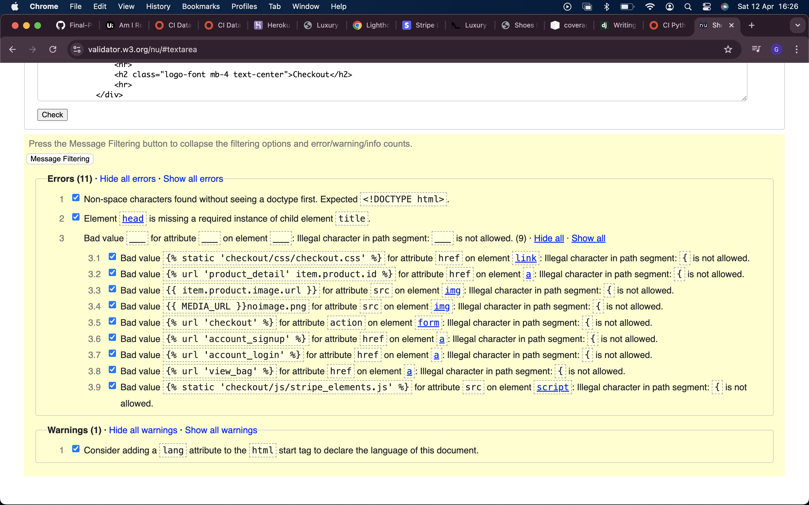
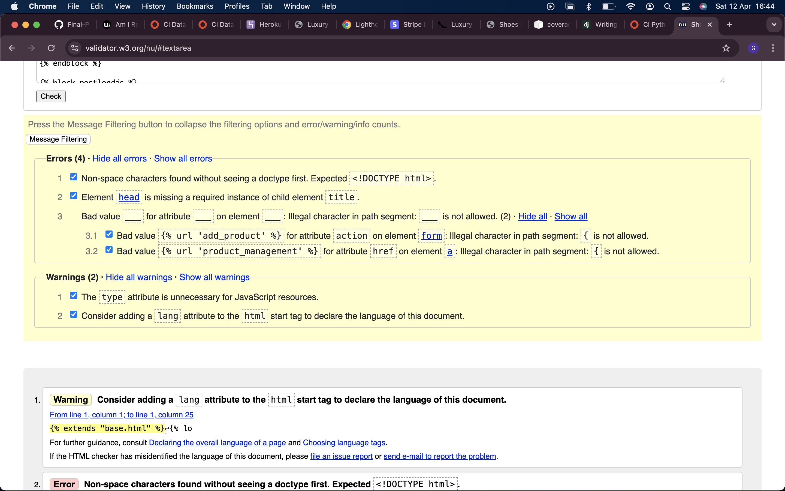
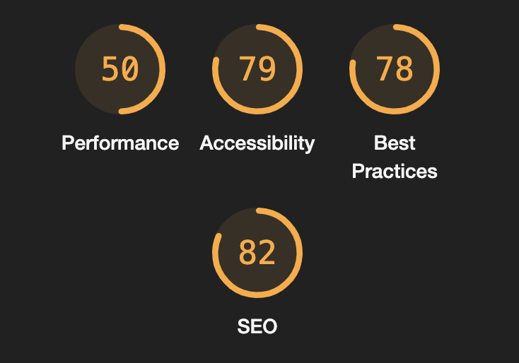

# Luxury Shoes Testing

[Live webpage](https://luxury-shoes-00974b0f1528.herokuapp.com/)

## Contents

_ _ _

1. [Automated Testing](#automated-testing)
1. [Validation Testing](#validation-testing)
    * [HTML Validation](#html-validation)
    * [CSS Validation](#css-validation)
    * [JavaScript Validation](#javascript-validation)
    * [Python Validation](#python-validation)
    * [Accessibility](#accessibility)
    * [Performance](#performance)
2. [Manual Testing](#manuel-testing)
    * [Device Testing](#device-testing)
    * [Browser Compatibility](#browser-compatibility)
    * [Testing User Stories](#testing-user-stories)
3. [Bugs](#bugs)

Due to issues with the previous attempt of this website application, I consistently tested the website upon each change to make sure it was running as intended. When necessary I wrote print statements, to identify code was running correctly and made adjustments if needed. I also used Heroku's logs to identify issues with the deployed website that were not present in the local development.

## Automated Testing
As I was unfamiliar with unit testing as well as Django's unit testing, I tried a couple of unit tests (that were written by jamie2210), but was not confident doing a lot of unit tests and tried to focus on my understanding of what I was looking at as a learning opportunity. Test Driven Development is something I would love to learn more about as its applications for future code I work on will, i'm sure, prove invaluable.
_ _ _

- I used 5 unit tests using the Django unit test framework [Django TestCase](https://docs.djangoproject.com/en/4.1/topics/testing/overview/)

### Testing Results

A total of 5 tests all passing with no errors.

### Coverage Results

Coverage Report

 

- The coverage report shows a number of files that have 100% coverage but there are multiple files that are showing low percentages.
- As I am fairly new to Test Driven Development, Coverage is something I plan on learning more about as I expand my knowledge on unit testing. Hopefully, in the future, I will be able to develop unit tests for my code that hit 100% coverage.

## Validation Testing
_ _ _

### HTML Validation

[W3C](https://validator.w3.org/) Markup Validation Service was used to validate the HTML of the website. Every single HTML page has errors due to it not being able to read Jinja templating. No urgent errors appeared that meant the code needed adjusting.

bag.html

 

checkout.html

 

checkout_success.html

 

base.html

 

index.html

 

send_marketing_email.html

 

marketing_email.html

 

profile.html

 

products.html

 

product_detail.html

 

product_management.html

 

add_product.html

 

edit_product.html

 

### CSS Validation

[W3C](https://jigsaw.w3.org/css-validator/) Jigsaw CSS Validation Service was used to validate the CSS of the website.
Base.css had one error which I researched into. It was found that font-optical-sizing, which is present for the main Raleway font, is a newer configuration used for better readability at different sizes and that the validator may not have been updated yet to pass it. The warning 'vendor-prefixed properties' warning is because variables have been used to maximise compatibility with older browsers. The warning of 'background-color and border-color' being the same is because I intentionally set the colours to be the same in the hover state.

base.css

 

checkout.css

 

profile.css

 

### JavaScript Validation

[JS Hint](https://jshint.com/) JS Validation Service was used to validate the Javascript files. When testing the quantity-input-script.html code JShint had difficulty identifying that it was within HTML, so i added the esversion and global comments at the top of the code. This still returned errors but upon inspection of the code, no changes were necessary.

checkout.js

quantity-input-script.html

### Python Validation

[pep8ci](#https://pep8ci.herokuapp.com/) was the linter used to check the python code, all clear with no errors.
 

| File | &#9989; (Pass) / &#10060; (Fail) | Proof |
| :--- | :--- | :---: |
| custom_storages.py | &#9989; | [custom_storages.py validation](TESTING/media/python_linter/validator-py-custom-storage.png) |
| **LUXURY_SHOES** |
| luxury_shoes/settings.py | &#9989; | [settings.py validation](TESTING/media/python_linter/validator-py-settings.png) |
| luxury_shoes/urls.py | &#9989; | [urls.py validation](TESTING/media/python_linter/validator-py-urls.png) |
| **BAG** |
| bag/apps.py | &#9989; | [apps.py validation](TESTING/media/python_linter/validator-py-bag-apps.png) |
| bag/contexts.py | &#9989; | [contexts.py validation](TESTING/media/python_linter/validator-py-bag-contexts.png) |
| bag/urls.py | &#9989; | [urls.py validation](TESTING/media/python_linter/validator-py-bag-urls.png) |
| bag/views.py | &#9989; | [views.py validation](TESTING/media/python_linter/validator-py-bag-views.png) |
| bag/templatetags/bag_tools.py | &#9989; | [bag_tools.py validation](TESTING/media/python_linter/validator-py-bag-bag-tools.png)|
| **CHECKOUT** |
| checkout/admin.py | &#9989; | [admin.py validation](TESTING/media/python_linter/validator-py-checkout-admin.png) |
| checkout/apps.py | &#9989; | [apps.py validation](TESTING/media/python_linter/validator-py-checkout-apps.png) |
| checkout/forms.py | &#9989; | [forms.py validation](TESTING/media/python_linter/validator-py-checkout-forms.png) |
| checkout/models.py | &#9989; | [models.py validation](TESTING/media/python_linter/validator-py-checkout-models.png) |
| checkout/signals.py | &#9989; | [signals.py validation](TESTING/media/python_linter/validator-py-checkout-signals.png) |
| checkout/urls.py | &#9989; | [urls.py validation](TESTING/media/python_linter/validator-py-checkout-urls.png) |
| checkout/views.py | &#9989; | [views.py validation](TESTING/media/python_linter/validator-py-checkout-views.png) |
| checkout/webhook_handler.py | &#9989; | [webhook_handler.py](TESTING/media/python_linter/validator-py-checkout-webhook-handler.png) |
| checkout/webhooks.py | &#9989; | [webhooks.py](TESTING/media/python_linter/validator-py-checkout-webhook.png) |
| checkout/test_models.py | &#9989; | [test_models.py validation](TESTING/media/python_linter/validator-py-checkout-test-models.png)|
| **HOME** |
| home/apps.py | &#9989; | [apps.py validation](TESTING/media/python_linter/validator-py-home-apps.png) |
| home/urls.py | &#9989; | [urls.py validation](TESTING/media/python_linter/validator-py-home-urls.png)|
| home/views.py | &#9989; | [views.py validation](TESTING/media/python_linter/validator-py-home-views.png) |
| **PRODUCTS** |
| products/admin.py | &#9989; | [admin.py validation](TESTING/media/python_linter/validator-py-products-admin.png) |
| products/apps.py | &#9989; | [apps.py validation](TESTING/media/python_linter/validator-py-products-apps.png) |
| products/forms.py | &#9989; | [forms.py validation](TESTING/media/python_linter/validator-py-products-forms.png) |
| products/models.py | &#9989; | [models.py validation](TESTING/media/python_linter/validator-py-products-models.png) |
| products/urls.py | &#9989; | [urls.py validation](TESTING/media/python_linter/validator-py-products-urls.png) |
| products/views.py | &#9989; | [views.py validation](TESTING/media/python_linter/validator-py-products-views.png) |
| products/widgets.py | &#9989; | [widgets.py validation](TESTING/media/python_linter/validator-py-products-widgets.png) |
| products/test_models.py | &#9989; | [test_models.py validation](TESTING/media/python_linter/validator-py-products-test-models.png) |
| **PROFILES** |
| profiles/admin.py | &#9989; | [admin.py validation](TESTING/media/python_linter/validator-py-profiles-admin.png) |
| profiles/apps.py | &#9989; | [apps.py validation](TESTING/media/python_linter/validator-py-profiles-apps.png) |
| profiles/forms.py | &#9989; | [forms.py validation](TESTING/media/python_linter/validator-py-profiles-forms.png) |
| profiles/models.py | &#9989; | [models.py validation](TESTING/media/python_linter/validator-py-profiles-models.png) |
| profiles/urls.py | &#9989; | [urls.py validation](TESTING/media/python_linter/validator-py-profiles-urls.png) |
| profiles/views.py | &#9989; | [views.py validation](TESTING/media/python_linter/validator-py-profiles-views.png) |

### Performance

Performance testing was done using lighthouse in chrome developer tools testing the performance, accessibility, best practices, and SEO of the website. I didn't expect the scores to be as low as they were so I looked into the possibility of whether my laptop would affect the scores. This turned out to be the case. I am using a Macbook Pro 2017 laptop and a wifi connection that isn't the strongest. The positive was that none of the results returned anything that needed urgently addressing. 

**Lighthouse Desktop Test Results**

Bag

Checkout

Checkout Success

Home

Marketing Email

Product Management

Products

Product Detail

Product Add

Product Edit

Profile

Register

 

Sign In

Sign Out

Performance for mobile testing was much slower, in particular, the checkout/checkout success pages. This was difficult to improve due to most of the issues being essential Javascript, CSS and third party code such as Stripe, Bootstrap, AWS and Google Fonts. Again, the issue of my laptop age/ internet may have negatively impacted the results showing.

**Lighthouse Mobile Test Results**

Bag

Checkout

Checkout Success

Home

Marketing Email

Products

Product Detail

Product Add

Product Edit

Profile

Register

Sign In

Sign Out

 

### Accessibility

To ensure the site is accessible as possible I have taken the following steps:

- Using semantic HTML.
- Alt attributes on images.
- Label functions, links, buttons, forms and input fields to ensure clarity of the roles for all features.
- Ensuring that there is a sufficient colour contrast throughout the site.

[Wave accessibility](#https://wave.webaim.org/) was used to test the websites accessibility, all results have no errors. Unfortunately, Wave could not test the Checkout and Product Management Pages.

- Bag (empty) [results](TESTING/media/wave/wave-bag.png)
- Checkout Success [results](TESTING/media/wave/wave-checkout-success.png)
- Home [results](TESTING/media/wave/wave-home.png)
- Log In [results]() -------- aria labels
- Products [results](TESTING/media/wave/wave-products.png)
- Product Detail [results](TESTING/media/wave/wave-product-detail.png)
- Register [results]() ------ aria labels

## Manual Testing
_ _ _

### Device testing
The website was tested on the following devices:
- MacBook Pro
- iPad Tablet
- Android Phone
- iPhone 15 Pro

In addition, during development Google Developer Tools were used to make sure the website was built in a mobile friendly manner.

### Browser Compatibility

The website was tested on the following browsers:
- Apple Safari
- Google Chrome
- Mozilla Firefox

### Developer Feature Testing (Manual)

| Feature | Testing Performed | &#9989; (Pass) / &#10060; (Fail) |
| --- | --- | --- |
| Register | Sign up and email confirmation working | &#9989; |
| Login / Logout | Both functions work as intended | &#9989; |
| Forgot Password | Reset and email links all work as intended | &#9989; |
| Links | Check all links navigate correctly | &#9989; |
| Buttons | Check all buttons function correctly | &#9989; |
| Search Bar | Check search criteria works | &#9989; |
| Sort Selection | Sort selection sorts correctly | &#9989; |
| Product Links | Products link to correct product detail | &#9989; |
| Product Edit | Edits and updates correct product | &#9989; |
| Product Add | Adds product and its details correctly | &#9989; |
| Product Edit Modal | Button calls modal, modal deletes product | &#9989; |
| Product Delete Modal | Button calls modal, modal deletes product | &#9989; |
| Image On Click | Links work correctly, open new window | &#9989; |
| Image upload | Image uploads and displays correctly | &#9989; |
| Size Selection | Size updates to size selected | &#9989; |
| Quantity Updates | Quantity updates from product and bag view | &#9989; |
| Add to Bag | Correct items add to bag | &#9989; |
| Update Bag | Correctly update items in bag | &#9989; |
| Toasts | Toasts appear when adding, removing and updating bag as well as signing in and out of the site | &#9989; |
| Checkout | Bag items displayed in checkout | &#9989; |
| Payment | Stripe payment received | &#9989; | 
| Purchase | Webhooks sent and all working without errors| &#9989; |
| Checkout emails | Confirmation emails delivered with correct order information | &#9989; |
| Profile Page | Personal information and order history displays correctly | &#9989; |

### Testing User Stories
_ _ _

**Viewing & Navigation**

1. As a shopper I want to be able to vie the products so that I can select what I want to purchase.

    | **Feature** | **Action** | **Expected Result** | **Actual Result** |
    |-------------|------------|---------------------|-------------------|
    | Shoes  | Click button  | Go to all shoes | Works as expected |
    | Accessories  | Click button  | Go to all accessories | Works as expected |
    | All products  | Click drop down link  | Go to all products | Works as expected |

    

Shoes

    
    

    

Accessories

    
    

     

All Products

    
    

     

2. As a shopper I want to be able to view the products via specific categories so that I can quickly find the products I want to purchase.

    | **Feature** | **Action** | **Expected Result** | **Actual Result** |
    |-------------|------------|---------------------|-------------------|
    | Main category nav link | Click link | Go to specified category page | Works as expected |
    | Sub category nav link | Click link | Go to specified category page | Works as expected |

    

View Category

    
    

    

View Sub Category

    
    

     

3. As a shopper I want to be able to view individual product details so that I can see how much the item costs, read the description and see what sizes are available.

    | **Feature** | **Action** | **Expected Result** | **Actual Result** |
    |-------------|------------|---------------------|-------------------|
    | View product detail | Click on product | View product detail page | Works as expected |

    

Product Detail

    
    

     

4. As a shopper I want to be able to view the total of my shopping bag so that I can be aware of how much money I am spending.

    | **Feature** | **Action** | **Expected Result** | **Actual Result** |
    |-------------|------------|---------------------|-------------------|
    | View shopping bag | Click on bag | Shopping bag total displayed | Works as expected |

    

View Shopping Bag

    
    

     

**Registration & User Accounts**

5. As a site user I want to be able to register and account so that I can keep my details/orders saved.

    | **Feature** | **Action** | **Expected Result** | **Actual Result** |
    |-------------|------------|---------------------|-------------------|
    | Register | Click register | View register page | Works as expected |

    

Register

    
    

     

6. As a site user I want to be able to login/logout so that I can access my personal account information securely and prevent unwanted access.

    | **Feature** | **Action** | **Expected Result** | **Actual Result** |
    |-------------|------------|---------------------|-------------------|
    | Login | Click login | Go to Login page | Works as expected |
    | Logout | Click logout | To sign user out | Works as expected |

    

Login

    
    

    

Logout

    
    

     

7. As a site user I want to be able to recover my password if I forget it so that I can recover access to my account.

    | **Feature** | **Action** | **Expected Result** | **Actual Result** |
    |-------------|------------|---------------------|-------------------|
    | Recover Password | Click forgot password | To recover password | Works as expected |
    | Recover Password Email | Click forgot password | Receive email to recover | Works as expected |

    

Recover Password

    
    

    

Recover Password Email

    
    

     

8. As a site user I want to be able to received a confirmation email after registering so that I can verify that my account registration was successful.

    | **Feature** | **Action** | **Expected Result** | **Actual Result** |
    |-------------|------------|---------------------|-------------------|
    | Confirm email | Confirm email on the account | Go to reset link email confirmation page | Works as expected |

    

Confirmation Email Page

    
    

     

9. As a site user I want to be able to have a user profile specific to me so that I can see my order history and presaved shipping address.

    | **Feature** | **Action** | **Expected Result** | **Actual Result** |
    |-------------|------------|---------------------|-------------------|
    | Profile | Click profile | Go to profile | Works as expected |

    

Profile

    
    

     

**Sorting & Searching**

10. As a shopper I want to be able to save my shopping bag when I leave the site so that I can easily make a purchase when I am ready.

    | **Feature** | **Action** | **Expected Result** | **Actual Result** |
    |-------------|------------|---------------------|-------------------|
    | Add to basket | Click add to basket | Product added to basket | Works as expected |
    | Shopping bag populated | Open website and navigate to shopping bag | Product still in basket| Works as expected |

    

Add to Basket

    
    

    

Shopping Bag Populated

    
    

     

11. As a shopper I want to be able to sort the products available on the site so that I can easily find the products i am interested in.

    | **Feature** | **Action** | **Expected Result** | **Actual Result** |
    |-------------|------------|---------------------|-------------------|
    | Categories | Click Shoe/ Accessories dropdown | Show relevant product pages | Works as expected |

    

Categories

    
    

     

12. As a shopper I want to be able to sort a specific category of product so that I can easily find the products according to rating, price, category and name.

    | **Feature** | **Action** | **Expected Result** | **Actual Result** |
    |-------------|------------|---------------------|-------------------|
    | Sort Products | Click on sort products dropdown | Products sorted by rating, category, price | Works as expected |

    

Sort Products

    
    

     

13. As a shopper I want to be able to search for a product using keywords so that I can find products relevant to my needs.

    | **Feature** | **Action** | **Expected Result** | **Actual Result** |
    |-------------|------------|---------------------|-------------------|
    | Search Products | Type keyword in search bar | View by products with that keyword | Works as expected |

    

Search Products

    
    

     

14. As a shopper I want to be able to see the results of what I've search for so that I can decide whether the product is suitable for what I want.

    | **Feature** | **Action** | **Expected Result** | **Actual Result** |
    |-------------|------------|---------------------|-------------------|
    | Search Results | Click search | View products relevant to search criteria | Works as expected |

    

Search Results

    
    

     

**Purchasing & Checkout**

15. As a shopper I want to be able to select the size and quantity of a product I want to purchase so that I can make a purchase that fulfills my needs.

    | **Feature** | **Action** | **Expected Result** | **Actual Result** |
    |-------------|------------|---------------------|-------------------|
    | Size & Quantity Selector | Select size and quantity | Size and Quantity selector and dropdown appears | Works as expected |

    

Size and Quantity Selector

    
    

     

16. As a shopper I want to be able to view items that are in my shopping bag so that I can check that my shopping bag contains what I want and view a detailed price breakdown showing the total costs.

    | **Feature** | **Action** | **Expected Result** | **Actual Result** |
    |-------------|------------|---------------------|-------------------|
    | Shopping Bag | Click shopping bag | Shopping bag table with products shown | Works as expected |

    

Shopping Bag

    
    

     

17. As a shopper I want to be able to adjust the quantity of individual items in my bag so that I can make changes to the quantity without navigating away from the checkout. 

    | **Feature** | **Action** | **Expected Result** | **Actual Result** |
    |-------------|------------|---------------------|-------------------|
    | Quantity Adjustment In Bag | Adjust quantity in bag | Quantity adjusts | Works as expected |

    

Quantity Adjustment In Bag

    
    

     

18. As a shopper I want to be able to enter my payment information so that I can pay for the products I've chosen to buy.

    | **Feature** | **Action** | **Expected Result** | **Actual Result** |
    |-------------|------------|---------------------|-------------------|
    | Payment Form | Input payment details to process transaction | Payment processes | Works as expected |

    

Payment Form

    
    

     

19. As a shopper I want to be able to checkout securely with no risk so that I can provide the sensitive information needed to purchase the products with confidence.

    | **Feature** | **Action** | **Expected Result** | **Actual Result** |
    |-------------|------------|---------------------|-------------------|
    | Secure Checkout | Click on secure payment | Checkout form appears | Works as expected |

    

Secure Checkout

    
    

     

20. As a shopper I want to be able to see an order confirmation so that I can check that the order is correct.

    | **Feature** | **Action** | **Expected Result** | **Actual Result** |
    |-------------|------------|---------------------|-------------------|
    | Checkout Success | Submit checkout form | Order processes and confirmation appears | Works as expected |

    

Checkout Success

    
    

     

21. As a shopper I want to be able to receive an email confirmation so that I can safely store the order in my mail as reference.

    | **Feature** | **Action** | **Expected Result** | **Actual Result** |
    |-------------|------------|---------------------|-------------------|
    | Email Order Confirmation | Submit Order | User receives email confirmation | Works as expected |

    

Email Order Confirmation

    
    

     

**Admin & Store Management**

22. As a store owner I want to be able to add a product so that I can add new products to the store for customers to shop.

    | **Feature** | **Action** | **Expected Result** | **Actual Result** |
    |-------------|------------|---------------------|-------------------|
    | Add Product | Fill out form and add product | Product is added to website | Works as expected |

    

Add Product

    
    

     

23. As a store owner I want to be able to Edit/Update a product so that I can edit/update details of products such as price, description, image, rating etc.

    | **Feature** | **Action** | **Expected Result** | **Actual Result** |
    |-------------|------------|---------------------|-------------------|
    | Edit/Update Product | Fill in edit product form | Product updates with changes | Works as expected |

    

Edit/Update Product

    
    

     

24. As a store owner I want to be able to delete a product so that I can remove products that are no longer available for sale.

    | **Feature** | **Action** | **Expected Result** | **Actual Result** |
    |-------------|------------|---------------------|-------------------|
    | Delete Product | Click delete product | Product is removed from website | Works as expected |

    

Delete Product

    
    

    

Delete Product Modal

    
    

     

25. As a store owner I want to be able to manage products in one place so that I can easily make necessary amendments without navigating to different areas of the site.

    | **Feature** | **Action** | **Expected Result** | **Actual Result** |
    |-------------|------------|---------------------|-------------------|
    | Product Management | Click Product Management | Go to Product Management | Works as expected |

    

Product Management

    
    

     

26. As a store owner I want to be able to send marketing emails to users so that I can send promotional emails to registered users and drive sales.

    | **Feature** | **Action** | **Expected Result** | **Actual Result** |
    |-------------|------------|---------------------|-------------------|
    | Marketing Email | Fill Marketing Email Form | Sends Marketing Email | Works as expected |

    

Marketing Email

    
    

     

## Bugs
_ _ _

### Internal Error 500

- When users tried to register or login/logout an 'Internal Error 500' appeared. 

    

- This seemed to be related to the email verification as the registration would be successful in the database but would not send an email for users to verify, which is why the error was appearing. This was related to the versions of python/django and their support of 'keyfile' and smtp.
- I was hesitant to adjust the version of Django, because of potential database issues, so I opted for changing my Python version from 3.12 to 3.11 and this resolved the issue.

    
    
    
    

### Checkout Email Confirmation/ Stripe Payment Intent Webhook Error 500

- When completing an order, an email confirmation would not be sent. The Stripe Payment Intent also retrieved an error 500.
- These issues were linked together because the information was not being collected/sent properly.

    
    
- It appeared that I had issues with how my logic handled metadata, so I adjusted this but the problem persisted.
- I then put the payment intent logic into a try/except and added logging errors, to run the checkout again and be able to identify specifically where the issue was appearing in the payment intent logic.
- The Heroku error log then showed that the EMAIL_FROM_ORDERS was not configured correctly which was causing the issue.

    
    
    

- This then fixed the issue with the email confirmation sending as well as the webhook payment intent passing.

    
    

- It was possible that the adjusted webhook_handler logic with the try/except and metadata handling wasn't needed, but it meant for more robust code so I kept it in place.