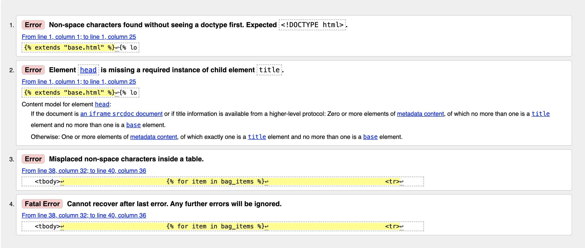

# Luxury Shoes Testing

[Live webpage](https://luxury-shoes-00974b0f1528.herokuapp.com/)

## Contents

_ _ _

1. [Automated Testing](#automated-testing)
1. [Validation Testing](#validation-testing)
    * [HTML Validation](#html-validation)
    * [CSS Validation](#css-validation)
    * [JavaScript Validation](#javascript-validation)
    * [Python Validation](#python-validation)
    * [Accessibility](#accessibility)
    * [Performance](#performance)
2. [Manual Testing](#manuel-testing)
    * [Device Testing](#device-testing)
    * [Browser Compatibility](#browser-compatibility)
    * [Testing User Stories](#testing-user-stories)
3. [Bugs](#bugs)

Due to issues with the previous attempt of this website application, I consistently tested the website upon each change to make sure it was running as intended. When necessary I wrote print statements, to identify code was running correctly and made adjustments if needed. I also used Heroku's logs to identify issues with the deployed website that were not present in the local development.

## Automated Testing
As I was unfamiliar with unit testing as well as Django's unit testing, I tried a couple of unit tests (that were written by jamie2210), but was not confident doing a lot of unit tests and tried to focus on my understanding of what I was looking at. Test Driven Development is something I would love to learn more about as its applications for future code I work on will, i'm sure, prove invaluable.
_ _ _

- I used 5 unit tests using the Django unit test framework [Django TestCase](https://docs.djangoproject.com/en/4.1/topics/testing/overview/)

### Testing Results

A total of 5 tests all passing with no errors.

### Coverage Results

Coverage Report

 

- The coverage report shows a number of files that have 100% coverage but there are multiple files that are showing low percentages.
- As I am fairly new to Test Driven Development, Coverage is something I plan on learning more about as I expand my knowledge on unit testing. Hopefully, in the future, I will be able to develop unit tests for my code that hit 100% coverage.

## Validation Testing
_ _ _

### HTML Validation

[W3C](https://validator.w3.org/) Markup Validation Service was used to validate the HTML of the website. Every single HTML page has errors due to it not being able to read Jinja templating. No urgent errors appeared that meant the code needed adjusting.

bag.html

 

checkout.html

 

checkout_success.html

 

base.html

 

index.html

 

send_marketing_email.html

 

marketing_email.html

 

profile.html

 

products.html

 

product_detail.html

 

product_management.html

 

add_product.html

 

edit_product.html

 

### CSS Validation

[W3C](https://jigsaw.w3.org/css-validator/) Jigsaw CSS Validation Service was used to validate the CSS of the website.
Base.css had one error which I researched into. It was found that font-optical-sizing, which is present for the main Raleway font, is a newer configuration used for better readability at different sizes and that the validator may not have been updated yet to pass it. The warning 'vendor-prefixed properties' warning is because variables have been used to maximise compatibility with older browsers. The warning of 'background-color and border-color' being the same is because I intentionally set the colours to be the same in the hover state.

base.css

 

checkout.css

 

profile.css

 

### JavaScript Validation

[JS Hint](https://jshint.com/) JS Validation Service was used to validate the Javascript files. When testing the quantity-input-script.html code JShint had difficulty identifying that it was within HTML, so i added the esversion and global comments at the top of the code. This still returned errors but upon inspection of the code, no changes were necessary.

checkout.js

quantity-input-script.html

### Python Validation

[pep8ci](#https://pep8ci.herokuapp.com/) was the linter used to check the python code, all clear with no errors.
 

| File | &#9989; (Pass) / &#10060; (Fail) | Proof |
| :--- | :--- | :---: |
| custom_storages.py | &#9989; | [custom_storages.py validation]() |
| **LUXURY_SHOES** |
| luxury_shoes/settings.py | &#9989; | [settings.py validation]() |
| luxury_shoes/urls.py | &#9989; | [urls.py validation]() |
| **BAG** |
| bag/apps.py | &#9989; | [apps.py validation]() |
| bag/contexts.py | &#9989; | [contexts.py validation]() |
| bag/urls.py | &#9989; | [urls.py validation]() |
| bag/views.py | &#9989; | [views.py validation]() |
| bag/templatetags/bag_tools.py | &#9989; | [bag_tools.py validation]()|
| bag/test_views.py | &#9989; | [test_views.py validation]() |
| **CHECKOUT** |
| checkout/admin.py | &#9989; | [admin.py validation]() |
| checkout/apps.py | &#9989; | [apps.py validation]() |
| checkout/forms.py | &#9989; | [forms.py validation]() |
| checkout/models.py | &#9989; | [models.py validation]() |
| checkout/signals.py | &#9989; | [signals.py validation]() |
| checkout/urls.py | &#9989; | [urls.py validation]() |
| checkout/views.py | &#9989; | [views.py validation]() |
| checkout/webhook_handler.py | &#9989; | [webhook_handler.py]() |
| checkout/webhooks.py | &#9989; | [webhooks.py]() |
| checkout/test_forms.py | &#9989; | [test_forms.py validation]()|
| checkout/test_models.py | &#9989; | [test_models.py validation]()|
| checkout/test_views.py | &#9989; | [test_views.py validation]() |
| **HOME** |
| home/apps.py | &#9989; | [apps.py validation]() |
| home/urls.py | &#9989; | [urls.py validation]()|
| home/views.py | &#9989; | [views.py validation]() |
| home/test_views.py | &#9989; | [test_views.py validation]() |
| **PRODUCTS** |
| products/admin.py | &#9989; | [admin.py validation]() |
| products/apps.py | &#9989; | [apps.py validation]() |
| products/forms.py | &#9989; | [forms.py validation]() |
| products/models.py | &#9989; | [models.py validation]() |
| products/urls.py | &#9989; | [urls.py validation]() |
| products/views.py | &#9989; | [views.py validation]() |
| products/widgets.py | &#9989; | [widgets.py validation]() |
| products/test_models.py | &#9989; | [test_models.py validation]() |
| products/test_views.py | &#9989; | [test_views.py validation]() |
| **PROFILES** |
| profiles/apps.py | &#9989; | [apps.py validation]() |
| profiles/forms.py | &#9989; | [forms.py validation]() |
| profiles/models.py | &#9989; | [models.py validation]() |
| profiles/urls.py | &#9989; | [urls.py validation]() |
| profiles/views.py | &#9989; | [views.py validation]() |
| profiles/test_models.py | &#9989; | [test_models.py validation]() |
| profiles/test_views.py | &#9989; | [test_views.py validation]() |

### Performance

Performance testing was done using lighthouse in chrome developer tools testing the performance, accessibility, best practices, and SEO of the website. Some of the scores are lower than I'd like them to be, this is down mainly to resources blocking the first paint of the page. This is something with more time I'd like to read up on and gain a better understanding but due to time constraints I am happy with the current scores.
 

First Paint Message Example

 

**Lighthouse Desktop Test Results**

Bag

Checkout

Checkout Success

Home

Login

Logout

Product Management

Products

Product Detail

Product Add

Product Edit

Profile

Register

 

Performance was slower for mobile testing. I did as much as I could improve it with some scores as low as 24 now sitting around 60 or above for most. There isn't much more I could do as essential JS and CSS was the main cause, so I am happy with the improvement. 

Render Blocking

Reduce JS

 

**Lighthouse Mobile Test Results**

Bag

Checkout

Checkout Success

Contact

Contact Success

Favourites

Home

Products

Product Detail

Product Add

Product Edit

Profile

Register

Sign In

Sign Out

 

### Accessibility

To ensure the site is accessible as possible I have taken the following steps:

- Using semantic HTML.
- Alt attributes on images.
- Label functions, links, buttons, forms and input fields to ensure clarity of the roles for all features.
- Ensuring that there is a sufficient colour contrast throughout the site.

[Wave accessibility](#https://wave.webaim.org/) was used to test the websites accessibility, all results have no warnings or errors.

- Bag (empty) [results]()
- Bag (with product) [results]()
- Checkout [results]()
- Checkout Success [results]()
- Home [results]()
- Log In [results]()
- Products [results]()
- Product Detail [results]()
- Product Management [results]()
- Register [results]()

## Manuel Testing
_ _ _

### Device testing
The website was tested on the following devices:
- MacBook Pro
- iPad Tablet
- Android Phone
- iPhone 15 Pro

In addition, the website was tested using Google Chrome Developer Tools device toggle option for mobile development.

### Browser Compatibility

The website was tested on the following browsers:
- Apple Safari
- Google Chrome
- Microsoft Edge
- Mozilla Firefox

### Developer Feature Testing (Manual)

| Feature | Testing Performed | &#9989; (Pass) / &#10060; (Fail) |
| --- | --- | --- |
| Register | Sign up and email confirmation working | &#9989; |
| Login / Logout | Both functions work correctly | &#9989; |
| Forgot Password | Reset and email links all work correctly | &#9989; |
| Links | Check all links navigate correctly | &#9989; |
| Buttons | Check all buttons function correctly | &#9989; |
| Search Bar | Check search criteria works | &#9989; |
| Sort Selection | Sort selection sorts correctly | &#9989; |
| Product Links | Products link to correct product detail | &#9989; |
| Product Edit | Edits and updates correct product | &#9989; |
| Product Add | Adds product and its details correctly | &#9989; |
| Product Delete Modal | Button calls modal, modal deletes product | &#9989; |
| Image On Click | Links work correctly, open new window | &#9989; |
| Image1 upload | Image uploads and displays correctly | &#9989; |
| Size / Price | Price changes depending on size selected | &#9989; |
| Stock Level Updates | Stock display correctly displays stock level | &#9989; |
| Quantity Updates | Quantity updates from product and bag view | &#9989; |
| Add / Remove Favourites Icon | Adds and removes favourites correclty | &#9989; |
| Remove Favourites Modal | Button calls modal, modal removes product | &#9989; |
| Contact Admin | Contact form delivers message to admin | &#9989; |
| Contact Emails | Emails are sent to both user and store email | &#9989; |
| Add to Bag | Correct items add to bag | &#9989; |
| Update Bag | Correctly update items in bag | &#9989; |
| Checkout | Bag items displayed in checkout | &#9989; |
| Payment | Stripe payment received | &#9989; | 
| Purchase | Webhooks sent and all working | &#9989; |
| Checkout emails | Confirmation emails delivered with correct order information | &#9989; |
| Profile Page | Personal information and order history displays correctly | &#9989; |
| Social Links | Links work correctly, open new window | &#9989; |

### Testing User Stories
_ _ _

**Viewing & Navigation**

1. As a shopper I want to be able to vie the products so that I can select what I want to purchase.

    | **Feature** | **Action** | **Expected Result** | **Actual Result** |
    |-------------|------------|---------------------|-------------------|
    | Shoes  | Click button  | Go to all shoes | Works as expected |
    | Accessories  | Click button  | Go to all accessories | Works as expected |
    | All products  | Click drop down link  | Go to all products | Works as expected |

    

Shoes

    
    

    

Accessories

    
    

     

All Products

    
    

     

2. As a shopper I want to be able to view the products via specific categories so that I can quickly find the products I want to purchase.

    | **Feature** | **Action** | **Expected Result** | **Actual Result** |
    |-------------|------------|---------------------|-------------------|
    | Main category nav link | Click link | Go to specified category page | Works as expected |
    | Sub category nav link | Click link | Go to specified category page | Works as expected |

    

View Category

    
    

     

3. As a shopper I want to be able to view individual product details so that I can see how much the item costs, read the description and see what sizes are available.

    | **Feature** | **Action** | **Expected Result** | **Actual Result** |
    |-------------|------------|---------------------|-------------------|
    | View product detail | Click on product | View product detail page | Works as expected |

    

Product Detail

    
    

     

4. As a shopper I want to be able to view the total of my shopping bag so that I can be aware of how much money I am spending.

    | **Feature** | **Action** | **Expected Result** | **Actual Result** |
    |-------------|------------|---------------------|-------------------|
    | View shopping bag | Click on bag | Shopping bag total displayed | Works as expected |

    

View Shopping Bag

    
    

     

**Registration & User Accounts**

5. As a site user I want to be able to register and account so that I can keep my details/orders saved.

    | **Feature** | **Action** | **Expected Result** | **Actual Result** |
    |-------------|------------|---------------------|-------------------|
    | Register | Click register | View register page | Works as expected |

    

Register

    
    

     

6. As a site user I want to be able to login/logout so that I can access my personal account information securely and prevent unwanted access.

    | **Feature** | **Action** | **Expected Result** | **Actual Result** |
    |-------------|------------|---------------------|-------------------|
    | Login | Click login | Go to Login page | Works as expected |
    | Logout | Click logout | To sign user out | Works as expected |

    

Login

    
    

    

Logout

    
    

     

7. As a site user I want to be able to recover my password if I forget it so that I can recover access to my account.

    | **Feature** | **Action** | **Expected Result** | **Actual Result** |
    |-------------|------------|---------------------|-------------------|
    | Recover Password | Click forgot password | To recover password | Works as expected |

    

Recover Password

    
    

     

8. As a site user I want to be able to received a confirmation email after registering so that I can verify that my account registration was successful.

    | **Feature** | **Action** | **Expected Result** | **Actual Result** |
    |-------------|------------|---------------------|-------------------|
    | Forgotten password | Click 'Forgotten Password?' link | Go to reset password confirmation page | Works as expected |
    | Confirm email | Confirm email on the account | Go to reset link email confirmation page | Works as expected |
    | Reset link | Click link | Go to reset password page | Works as expected |
    | New password | Enter new password | Confirm new password | Works as expected |
    | New password confirmed | Click 'change password' button | New password confirmed | Works as expected |

    

Forgotten Password

    
    

    

Confirm Email

    
    

    

Confirmation email Page

    
    

    

Reset Link

    
    

    

Enter New Password

    
    

    

New Password Confirmation

    
    

     

9. As a site user I want to be able to have a user profile specific to me so that I can see my order history and presaved shipping address.

    | **Feature** | **Action** | **Expected Result** | **Actual Result** |
    |-------------|------------|---------------------|-------------------|
    | Profile | Click profile | Go to profile | Works as expected |

    

Profile

    
    

     

**Sorting & Searching**

10. As a shopper I want to be able to save my shopping bag when I leave the site so that I can easily make a purchase when I am ready.

    | **Feature** | **Action** | **Expected Result** | **Actual Result** |
    |-------------|------------|---------------------|-------------------|
    | Add to basket | Click add to basket | Product added to basket | Works as expected |
    | Close website window | Click close window | Closed window | Works as expected |
    | Shopping bag populated | Open website and navigate to shopping bag | Product still in basket| Works as expected |

    

Add to Basket

    
    

    

Close Website

    
    

    

Shopping Bag Populated

    
    

     

11. As a shopper I want to be able to sort the products available on the site so that I can easily find the products i am interested in.

    | **Feature** | **Action** | **Expected Result** | **Actual Result** |
    |-------------|------------|---------------------|-------------------|
    | Categories | Click Shoe/ Accessories dropdown | Show relevant product pages | Works as expected |

    

Categories

    
    

     

12. As a shopper I want to be able to sort a specific category of product so that I can easily find the products according to rating, price, category and name.

    | **Feature** | **Action** | **Expected Result** | **Actual Result** |
    |-------------|------------|---------------------|-------------------|
    | Sort Products | Click on sort products dropdown | Products sorted by rating, category, price | Works as expected |

    

Sort Products

    
    

     

13. As a shopper I want to be able to search for a product using keywords so that I can find products relevant to my needs.

    | **Feature** | **Action** | **Expected Result** | **Actual Result** |
    |-------------|------------|---------------------|-------------------|
    | Search Products | Type keyword in search bar | View by products with that keyword | Works as expected |

    

Search Products

    
    

     

14. As a shopper I want to be able to see the results of what I've search for so that I can decide whether the product is suitable for what I want.

    | **Feature** | **Action** | **Expected Result** | **Actual Result** |
    |-------------|------------|---------------------|-------------------|
    | Search Results | Click search | View products relevant to search criteria | Works as expected |

    

Search Results

    
    

     

**Purchasing & Checkout**

15. As a shopper I want to be able to sort multiple categories of products simultaneously so that I can find the best-priced across the broad categories, such as 'photography' or 'Film'.

    | **Feature** | **Action** | **Expected Result** | **Actual Result** |
    |-------------|------------|---------------------|-------------------|
    | Search broad category | Select by name or price | View alphabetically or by price | Works as expected |

    

Broad Category Search

    
    

     

16. As a shopper I want to be able to search for a poster by name or description so that I can find a specific product I'd like to purchase.

    | **Feature** | **Action** | **Expected Result** | **Actual Result** |
    |-------------|------------|---------------------|-------------------|
    | Search by name | Enter name | Name search results displayed | Works as expected |
    | Search by description | Enter description | Description search results displayed | Works as expected |

    

Search Name

    
    

    

Search Description

    
    

     

17. As a shopper I want to be able to easily see what I've searched for and the number of results so that I can quickly decide whether the product I want is available.

    | **Feature** | **Action** | **Expected Result** | **Actual Result** |
    |-------------|------------|---------------------|-------------------|
    | View search results | Search for multiple posters | Search results and number displayed | Works as expected |

    

View Search Results

    
    

     

18. As a shopper I want to be able to easily select the size and quantity of a poster when purchasing it so that I can ensure I don't accidentally select the wrong poster, quantity or size.

    | **Feature** | **Action** | **Expected Result** | **Actual Result** |
    |-------------|------------|---------------------|-------------------|
    | Select Size / Quantity | Select size and / or quantity on product detail page | Size and Quantity changes on selection | Works as expected |

    

Select Size / Quantity

    
    

     

19. As a shopper I want to be able to view items in my bag to purchase so that I can identify the total cost of my purchase and all items I will receive.

    | **Feature** | **Action** | **Expected Result** | **Actual Result** |
    |-------------|------------|---------------------|-------------------|
    | View cart | Click on cart icon | View cart with selected items in it | Works as expected |

    

View Cart

    
    

     

20. As a shopper I want to be able to adjust the quantity of individual items in my bag so that I can easily make changes to my purchases before checkout.

    | **Feature** | **Action** | **Expected Result** | **Actual Result** |
    |-------------|------------|---------------------|-------------------|
    | Adjust Quantity in Cart | Change quantity with selector, click update | Quantity is updated | Works as expected |

    

Adjust Quantity

    
    

     

21. As a shopper I want to be able to easily enter my payment information so that I can check out quickly and with no hassles.

    | **Feature** | **Action** | **Expected Result** | **Actual Result** |
    |-------------|------------|---------------------|-------------------|
    | Information Form | Fil out form | Clearly labelled form to fill out | Works as expected |

    

View Checkout From

    
    

     

**Admin & Store Management**

22. As a shopper I want to be able to feel my personal payment information is safe and secure so that I can confidently provide the needed information to make a purchase.

    | **Feature** | **Action** | **Expected Result** | **Actual Result** |
    |-------------|------------|---------------------|-------------------|
    | Secure Checkout | Click secure checkout button | View payment is via stripe (footer) | Works as expected |
    | Secure Checkout | Click secure checkout button | Information only populated if logged in and saved to profile | Works as expected |

    

Secure Checkout

    
    

     

23. As a shopper I want to be able to view an order confirmation after checkout so that I can verify that I haven't made any mistakes.

    | **Feature** | **Action** | **Expected Result** | **Actual Result** |
    |-------------|------------|---------------------|-------------------|
    | Make Payment | Click 'buy now' button | Checkout Success page confirms order | Works as expected |

    

Make Payment

    
    

     

24. As a shopper I want to be able to receive an email confirmation after checking out so that I can keep the confirmation of what I've purchased for my records.

    | **Feature** | **Action** | **Expected Result** | **Actual Result** |
    |-------------|------------|---------------------|-------------------|
    | Make Payment | Click 'buy now' button | Checkout Success page confirms order | Works as expected |
    | Confirmation Email | Click 'buy now' button | Order confirmation email confirms order | Works as expected |

    

Make Payment

    
    

    

Order Confirmation Email

    
    

     

**Admin & Store Management**

25. As a store owner I want to be able to add a poster so that I can upload new posters for sale to my store.

    | **Feature** | **Action** | **Expected Result** | **Actual Result** |
    |-------------|------------|---------------------|-------------------|
    | Add Product Page | Click Manage Items | Go to add product page | Works as expected |
    | Add Product | Fill out form, add product | New product is added | Works as expected |

    

Add Product Page

    
    

    

Add Product

    
    

     

26. As a store owner I want to be able to edit/update a poster so that I can change product prices, descriptions, sizes, images, stock and other product criteria.

    | **Feature** | **Action** | **Expected Result** | **Actual Result** |
    |-------------|------------|---------------------|-------------------|
    | Edit Product Page | Click edit button | Go to edit product page | Works as expected |
    | Edit Product | Fill out form, edit product | Edited product is update | Works as expected |

    

Edit Product Page

    
    

    

Edit Product

    
    

     

## Bugs
_ _ _

### Internal Error 500

- When users tried to register or login/logout an 'Internal Error 500' appeared. 

    

- This seemed to be related to the email verification as the registration would be successful in the database but would not send an email for users to verify, which is why the error was appearing. This was related to the versions of python/django and their support of 'keyfile' and smtp.
- I was hesitant to adjust the version of Django, to prevent database issues, so I opted for changing my Python version from 3.12 to 3.11 and this resolved the issue.

    
    
    
    

### Checkout Email Confirmation/ Stripe Payment Intent Webhook Error 500

- When completing an order, an email confirmation would not be sent. The Stripe Payment Intent also retrieved an error 500.
- These issues were linked together because the information was not being collected/sent properly.

    
- The issue was that each time the icon was clicked and therefore changed as a favourite was added or removed the event listeners were still looking for the old icon. It was only after refreshing the page would the tooltip now show on mouse over.
- While this worked ok, I knew it could work the way I wanted and should.

- By creating individual classes for both icons and specific functions for each class the page no longer needs to refresh for the mouse over to display the tooltip or vice versa.
- It's a long-winded way of doing it for such a small feature, but it was important to me that it worked how I wanted it to. I am very pleased that it now works how it should.